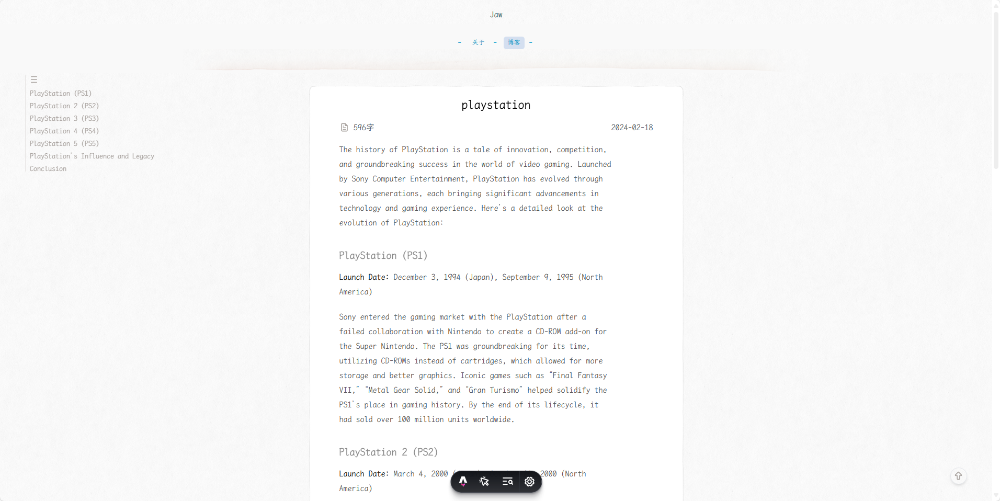

## astro-lofter-blog

A modern, stylish blog project built with Astro, designed for performance and ease of use.



### Technologies Used

- **Framework**: Astro
- **Styling**: UnoCSS
- **Code Quality**: TypeScript, @antfu/eslint-config, simple-git-hooks

### Setup and Development

To get started with the project, follow these steps:

1. **Install dependencies**:

   ```bash
   pnpm install
   ```

2. **Start the development server**:

   ```bash
   pnpm dev
   ```

### License

The styling is inspired by designs from [LOFTER](https://www.lofter.com/).Markdown styling is based on Anthony Fu's blog.

**Non-Commercial Use**: This project is for non-commercial use only, as the design is derived from third-party sources.

---

Start your blogging journey with Astro today, and enjoy a modern, fast, and customizable platform for your content!
